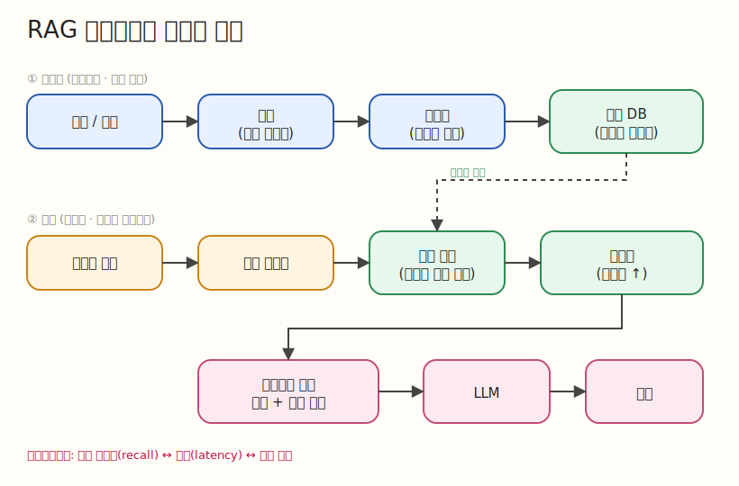

# RAG

RAG(Retrieval-Augmented Generation)를 백엔드 시스템 관점에서 학습하는
디렉터리입니다. 단순히 동작하는 파이프라인을 만드는 것보다, 검색 품질·비용·
지연·운영 관점에서 왜 그렇게 설계했는지 설명할 수 있는 것을 목표로 합니다.



## 문서

- [01. RAG가 무엇인가](./docs/01-what-is-rag.md) — 본질(검색 → 주입 → 생성)과 두 갈래 흐름

## 학습 범위

- **핵심 개념**: 임베딩, 청킹, 벡터 검색(ANN), 리랭킹, 컨텍스트 주입
- **구현 / 실습**: 문서 인덱싱 → 검색 → LLM 응답으로 이어지는 최소 파이프라인
- **성능 관점**: 검색 정확도(recall/precision) vs 지연 vs 토큰 비용 트레이드오프
- **현업 고민 포인트**: 인덱스 갱신, 캐싱, 환각 대응, 평가(eval) 자동화
- **경력직 면접 질문**: 청킹 전략, 벡터 DB 선택 기준, 검색 품질 측정 방법

## 실행 환경

이 디렉터리는 독립 uv 프로젝트입니다. 모든 명령은 `RAG/` 안에서 실행합니다.

```bash
uv sync                 # 의존성 설치 (.venv, uv.lock 생성)
uv run ruff check .     # 린트
uv run ruff format .    # 포맷
```

임베딩·벡터스토어·LLM 호출 의존성은 첫 실습 티켓에서 `pyproject.toml`에
추가합니다. 공통 규칙은 루트 `../AGENTS.md`와 `../docs/python-guidelines.md`를
따릅니다.
