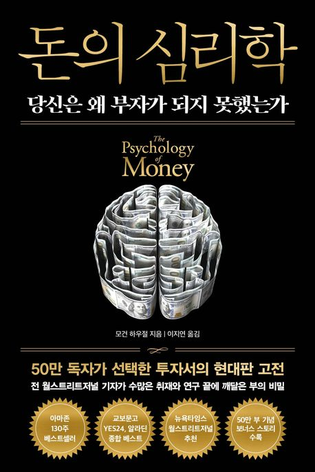

  

---

어떤 사람은 교육을 권하는 가정에서 태어나고, 어떤 사람은 교육을 반대하는 가정에서 태어난다.  
어떤 사람은 모험 정신을 장려하는 경제 번영기에 태어나고, 어떤 사람은 전쟁과 결핍의 시대에 태어난다.  
나는 네가 성공하기를 바라고, 네 힘으로 그렇게 되기를 원한다.  
하지만 모든 성공이 노력 덕분도 아니고 모든 빈곤이 게으름 때문도 아니라는 사실을 꼭 알아두어라.  
너 자신을 포함해, 누군가를 판단할 때는 이 점을 반드시 기억해라.

P. 61 ~ 62

---

사람은 변한다.  
이토록 흔한 명제를 왜 자신의 투자에는 대입하지 않을까.  
장기 계획을 짜는 것은 생각보다 어렵다.  
시간이 지나면 사람들은 목표도, 욕망도 바뀌기 때문이다.  

P. 250

---

비관주의는 기대치를 낮추고, 실제로 가능한 결과와 내가 기뻐할 수 있는 결과 사이의 거리를 좁힌다.  
어쩌면 그래서 비관주의가 그토록 매혹적일지도 모른다.  
모든게 잘 안될거라고 기대하는 것은 그게 사실이 아니었을 때 반갑게 놀랄 수 있는 최선의 방법이다.  
아이러니하게도, 그렇기 때문에 우리는 낙관적으로 생각할만하다.  

P. 302

---

1. 일이 잘 풀릴때는 겸손을 찾기 위해 노력을 기울이고, 일이 잘못될 때는 용서와 연민을 찾기 위해 최선을 다하라.  
2. 자존심은 줄이고 부는 늘려라.
3. 밤잠을 설치지 않을 방법을 택하라.
4. 시간을 보는 눈을 넓혀라.
5. 포르폴리오의 일부가 아닌 전체를 보라.
6. 내 시간을 내 뜻대로 하는 데 돈을 써라.
7. 남에게 더 친절하고, 자신에게 덜 요란해져라.
8. 저축하라. 그냥 저축하라.
9. 성공을 위한 비용은 기꺼이 지불하라.
10. 실수를 용인하는 태도를 가져라.
11. 장기적인 결정을 내릴 때 극단적 선택은 피하라.
12. 리스크를 좋아하라.
13. 나의 게임이 무엇인지 정의하라.
14. 돈 문제에 있어 각자 의견은 다르다. 혼란을 존중하라.

P. 333 ~ 339

---

프로 운동선수와 아마추어의 큰 차이는 바로 훈련 강도다.  
아마추어는 직관적으로 이렇게 생각한다. '할 수 있는 데까지 최대한 밀어붙이자. 내 잠재적 한계가 어디까지인지 테스트해보는 거야. 능력치를 최대한 끌어올려야 해.'  
그렇게 몸이 부서질때까지 갈아 넣는다. 고통 없이는 얻는 것도 없다는 식이다.  
반면에 프로 운동선수의 훈련 스케줄은 훨씬 차분하다.  
전체 훈련 스케줄을 분석해보니 아래와 같았다.  
- 저강도 훈련에 사용한 시간은 전체의 88.7% 였다.
- 중강도 훈련은 6.4% 였다.
- 고강도 훈련은 4.8% 였다.

놀랍지 않은가? 전 세계 일류 운동선수들이 본인의 잠재력보다 훨씬 낮은 수준의 훈련을 하면서 대부분의 시간을 보낸다는 사실이 말이다.  
훈련시에는 운동을 가장 잘할 수 있는 몸을 만드는데 치중해야한다. 운동 강도보다는 지속성이 중요하다.  
신체가 일시적 '고문'을 당하고 있다고 느끼기보다는 적응할 수 있게 신호를 주는 것이 필요하다.  
그래야 부상을 덜 당하고 정신적 번아웃을 당할 위험도 줄어든다.
'장기적 관점에서 최고 수준에 도달하고 싶다면 지속 가능한 훈련을 해야 한다.' 훌륭한 투자의 원리에도 그대로 적용되는 말 아닐까?

P. 398 ~ 400

---
