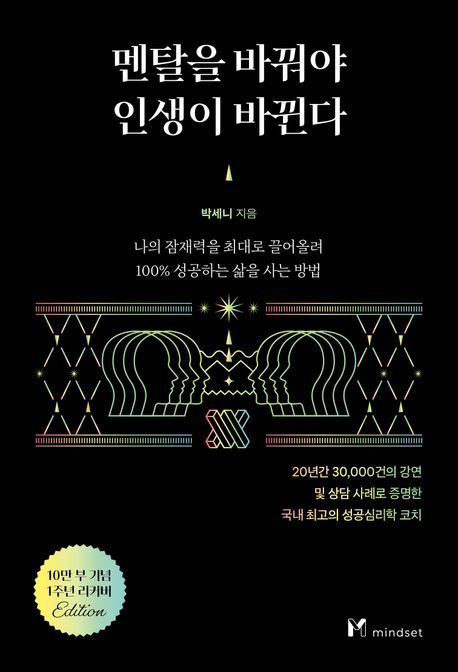

  

---

노력과 관련한 명언이 넘쳐난다.  

명언이 아니더라도 "노력은 배신하지 않는다.", "노력한 만큼 성공한다."는 말을 심심찮게 들었을 것이다.
그로 인해 많은 사람이 자기만의 노력을 하며 살아간다.  

~~ 사례 내용 ~~  

이 사례에서 알 수 있듯 노력이란 재미를 느끼고 잘하는 것에 자아도취 되어 몰입하는 것이 아니라,  

하기 싫을지라도 나에게도 세상에도 가치 있는 일을 해내는 것이다. 그리고 타인최면까지 가능한 수준이 돼야 진정한 노력이라 할 수 있다.  

P. 127 ~ 128

---
자신의 삶에서 반드시 이뤄야 하는 목표가 있다면 원하는 것 이외의 요소를 수없이 품고 있는 세상으로부터 자신을 보호할 수 있는 환경을 만들어야한다.  

초집중하는 삶을 살기 위해 그것을 방해하는 요소들로부터 멀어져야 한다는 의미다.  

진정으로 바라는 것을 되뇌며 마음속 깊이 새기는 것도 중요하지만, 한편으로 인간이 얼마나 쉽게 흔들리며 탈선할 수 있는지도 인정해야 한다.  

집중하는 힘을 뺏길 요소가 많은 환경 가운데 자신을 있게 하고 자신의 인내심과 의지력을 테스트하는 것보다 불필요한 요소들로부터 멀찍하게 떨어져 지내는 것이 낫다는 말이다.  

P. 188

---
