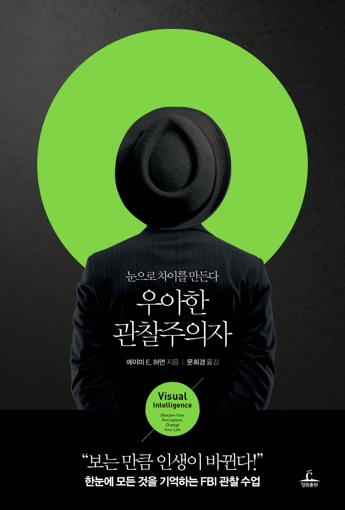

  

---
모든 것을 관찰하고 흡수하며 주변과 내면의 가능성을 발견할 마음의 준비를 해야 우리 자신의 삶에서 성공의 가능성을 찾을 것이다.  
관찰이란 단순히 대상을 수동적으로 바라보는 것이 아니라 적극적으로 관여하는 정신 과정이라는 점을 인식하면 이미 여정은 시작된 것이다.

---

어떤 상황을 접하고 전에 보거나 해본 일과 같을 거라고 생각하면 자기만의 지각 필터로 거르기 때문에 변화를 감지하기가 더 어려워진다.  
이렇게 생긴 눈가리개 때문에 중요한 세부 정보를 놓치거나 자동조종장치를 켜거나, 더 심각하게는 자신의 전문 지식이나 능력이나 안전에 관해  
주제넘게 나서게 될 수도 있다. 그리고 그 순간 모든 것이 위험해질 수 있다.