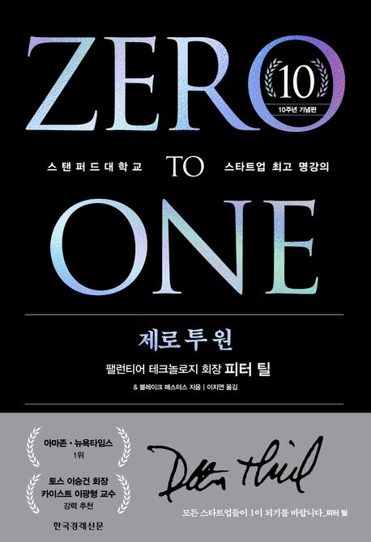

  

---
스타트업을 창업하기전 추천하는 책이지만,
나는 개발자로써 더 좋은 회사란 무엇이고, 그 회사는 어떠한 이유로 성장하였는가? 그리고 그러한 그 회사의 리더는 어떠한 가치관들을 가지고 있을까가 궁금해 찾게되었다.
그리고 그 구성원들은 어떠한 부분이 얼라인되어 참여하게되었을까가 궁금하여 찾게되었다.

스타트업에 구성원으로 있다보면 회사의 창업자 혹은 대표자가 사업의 방향성을 제시하거나 어떠한 가치관으로 회사를 경영하는지에 대한 궁금점이 생기게되는 계기가 있다.
그 과정을 직간접적으로 겪다보면 나또한 다양한 감정과 회고를 거치게된다.
더 나은 서비스를 제공하고싶고, 괜찮은 회사가 되길 바라며, 더 좋은 동료들이 들어오거나를 기대한다.
위와 같은 바램을 충족하기위한 베이스를 알기위한 책으로 접근했기에 해당 책을 읽고 과거 주마등처럼 지나가는 과정의 아쉬움과 앞으로의 과정 또한 한번 더 정리하게 된 계기가 되었다.

그리고, 페이팔 마피아들의 짧은 인생사와 기이안 행동도 알게되었다. 역시 다사다난하며 한 분야에 긱?한 사람들이다.

----

1. "경쟁하지말고 독점하라"
2. "광신 집단이 되라"

