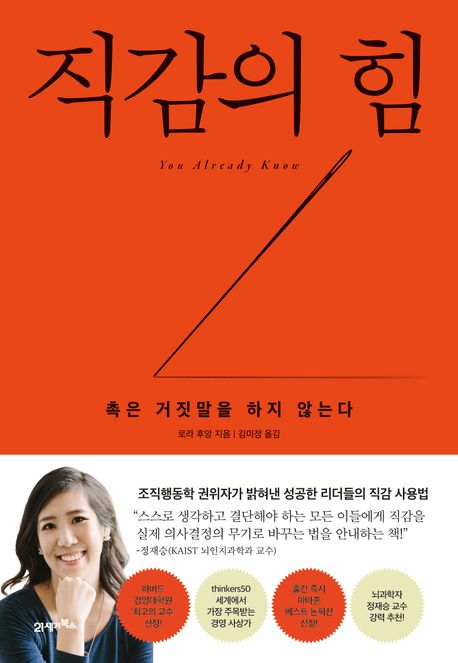

  

---
인생의 과정에서는 셀 수 없이 많은 의사결정을 하게 된다.    
그 순간은 누구나 최선의 선택을 하기 위해 노력할 것이다.    
어떤 선택은 돌아보면 좋은 결과를 가져왔을 수도 있고, 때로는 잘못된 길로 이어지기도 한다.    
각 선택은 여러 데이터와 정보에 의해 이루어지기도 하지만, 때로는 **직감**이라는 감각에 의해 이루어지기도 한다.    
이 책은 직감이란 무엇인지, 그것을 어떻게 알아차리고, 단련하며, 자주 느낄 수 있는지에 대해 알려 준다.

사실 책을 읽기 전까지 나는 **직감**이라는 단어를 부정적으로 바라보는 편이었다.    
아마도 많은 사람들과의 의사결정 과정에서 설득이 통하지 않고,    
누군가가 직감이라는 말을 꺼내며 방향이 엉뚱해지거나 잘못된 경험들이 떠올랐기 때문일 것이다.    
그 당시 나는 직감을 일차원적이고 단편적인 생각의 표출이라고 여겼다.    
그러나 책을 읽으며 나 스스로도 직감을 기반으로 선택을 해온 경험이 많았다는 것을 깨달았다.    
이 책은 우리가 말하는 직감이 무엇인지 구체적으로 이해할 수 있도록 충분한 통찰을 제공해 준다.

그리고 종이컵 채우기 이야기는 자주 생각날 것 같다.

---

1. 문제 유형별 해결 방법 p.87
    - 단순한 문제
      - 인지한다. 규칙을 파악한다. 규칙을 적용한다. 너무 깊이 생각하지 않는다.
    - 복합적 문제
      - 전략적으로 접근한다. 더 단순한 문제들로 나눈다.
      - 단순한 문제 각각을 해결한다.
      - 단순한 문제 각각의 해결을 도와줄 사람(전문가)을 추가한다.
    - 복잡한 문제
      - 성찰한다. 가능한 해결책들이 너무 많아서, 그것들 모두를 나열하고 합리적으로 비교하기가 어렵다는 점을 인지한다.
      - 문제와 증상을 구분한다. 직감에 의존한다.
    - 혼돈스러운 문제
      - 암묵적으로 행동한다. 여러 역학 관계가 존재하며 명확한 정답과 오답이 없음을 인정한다.
      - 직감에 의존한다.    

2. 배움을 멈추는 전문가가 되지 마라 p.241 ~
   - "의심은 유쾌하지 않은 일이지만 확신은 어리석은 짓이다" - 볼테르    
   

3. 경험에서 무언가를 배우는 가장 효과적인 방법 중 하나는,    
   놀랍게도 그 경험에서 한 발짝 물러나 적절한 맥락에 그것을 놓도 다시 이해해보려고 애쓰는 것이다. p. 244 ~
