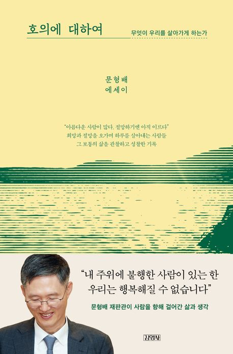

  

---
이 책을 선택하기 전, 
나는 주변이나 관련 있는 사람들에게 내 예민함이 부정적으로 전이되지 않도록 조심할 수 있는 방법이 무엇일까? 에 대한 생각을 가지면서  이 책을 집어 들었다.

읽는 동안 나는 마치 좋은 상사나 인생 선배의 이야기를 듣는 기분이었다.
작가는 나무를 깊이 사랑했고, 나무마다 각자의 이야기가 있다고 여겼다. 또한 그는 정상에 오르지 않는 등산을 좋아했다.

이 책은 제목이 던지는 ‘호의’에 대한 철학적 질문보다는, 그보다는 오히려 작가 문형배가 살아온 인생의 궤적을 보여준다.
그의 삶과 경험을 통해, 일상의 사소한 호의와 그것이 사람과 세상에 미치는 영향을 성찰하게 된****다.