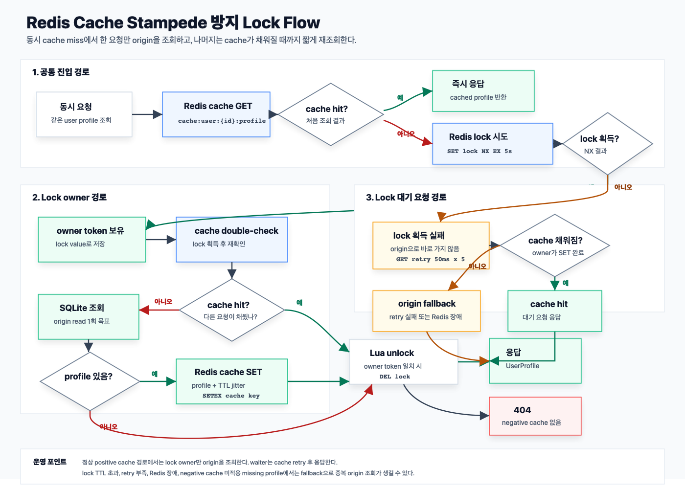

# Redis Cache Aside and TTL Strategy

## 시나리오

사용자의 프로필이 자주 조회되지만 자주 바뀌지 않는 기능(R8~9:W1~2) 으로 동작한다면,
아래와 같은 기준으로 적합한 방향은 어떤게 있을지 생각해보자

0. 들어가기전 체크
    - 현재 시나리오의 캐시의 이용은 영속성을 다루는 저장소로 이용이 아닌, 메모리를 이용한 빠른 응답 제공으로 성능 향상 초점을 두자
1. 캐시 전략
    1. 읽기(Look-Aside 패턴 사용)
        - 데이터의 조회를 캐시를 우선적으로 조회, 만일 없으면 DB에서 조회
            - 장점
                - 캐시레이어와 DB레이어를 분리해서 가용
                    - 캐시가 다운되어도 DB에서 가져올 수 있음
                - 모든 데이터를 캐시에 저장하는게 아닌 원하는 데이터만 별도로 캐시에 저장
                - 반복적인 읽기 호출에 적합
            - 단점
                - 정합성 유지 문제
                    - 캐시에 있는 데이터와 DB의 데이터간의 정합성 문제가 있음
                - 초기 조회시 문제 (Thundering Herd)
                    - 단건 호출 빈도가 높은(메인 페이지 조회) 곳에 초기 캐시에 데이터가 없어(Cache miss) 모든 호출이 DB로 가 부하가 생길 수 있음
    2. 쓰기(Write-Around 패턴 사용)
        - 모든 데이터 저장은 DB에만 이후 Cache miss시 캐시에 저장
            - 장점
                - Write Through 패턴보다 상대적 빠름
                    - Write Through 패턴 => 캐시와 DB에 동시에 데이터를 저장함
            - 단점
                - 속도는 빠르지만 Cache miss가 발생하기전에 DB의 데이터는 수정되었을때, 캐시와 DB와의 정합성 문제가 생김
    3. 결론

         <details>
         <summary>Look-Aside & Write-Around 조합으로 사용</summary>
         <div markdown="1">

         

         </div>
         </details>

2. 캐시 무효화 전략
    - 영구 저장소에 저장된 데이터의 복사본으로 동작하기에 캐시 <> DB와의 데이터 동기화 작업 필요
    - 적절한 TTL 설정으로 DB의 부하를 줄여주고, 캐시 데이터의 노후화되는 것도 방지 고려
    - 고려할 점
        - 캐시 스탬피드 대응
            - 키 만료시 수 많은 동시 요청이 DB로 가게되는 duplicated read 발생
            - 반대로, 동시에 DB에 읽어와 레디스에 duplicated write 도 발생
            - 불필요한 작업과 DB 과부하로 인한 장애 가능성

---

3. 캐시 공유 전략 (Race Condition)
    - 레디스는 공유 메모리처럼 동작
    - 만약 여러 인스턴스가 동시 공유 데이터의 업데이트를 한다면 의도와 다르게 문제가 발생 (overwrite)
    - 레디스는 싱글 스레드라고 하는데 '왜 atomic하게 동작하지 않지?'라고 생각할 수 있음
        - 레디스는 명령(command) 실행 단위의 싱글 스레드임 => 중요!
            - 동작 흐름을 보자면, 아래 3번의 동작을 하게됨 즉, 하나의 동작으로 보지 않음
                - (1) 읽기 -> (2) 어플리케이션 계산 -> (3) 다시 쓰기
    - 해결책
        - 락을 잘 거는 것이 중요한게 아닌, 락이 필요없는 구조를 만드는 게 중요하다. 항상 트레이드 오프를 생각하자

        1. Atomic Operation 사용
        2. Optimistic Lock
        3. Pessimistic Lock
        4. Distributed Lock
        5. lua script

----

## 이번 단계의 범위

Issue #28에서는 cache-aside 읽기 흐름만 구현한다.
Issue #29에서는 positive cache 저장 시 TTL과 TTL jitter를 적용한다.
Issue #30에서는 동시 cache miss 상황을 재현하고 Redis lock으로 origin 중복
조회를 완화한다.
Issue #31에서는 user profile 변경 후 캐시 삭제 전략을 적용하고 update-on-write와
비교한다.
Issue #32에서는 negative caching을 적용하고 Redis 캐시 전략을 면접 답변 형태로
정리한다.

----

## 저장소 선택

SQLite는 source of truth 역할만 담당한다. 이 프로젝트의 학습 대상은
RDBMS가 아니라 Redis 캐시 전략이므로, DB 운영과 ORM 복잡도를 줄이기 위해
SQLite를 선택했다.

이번 단계에서는 별도 내부 모델을 만들지 않고 기존 `UserProfileResponse`를
SQLite 조회 결과, Redis 캐시 값, API 응답에 함께 사용한다. 캐시 전략 학습이
우선이므로 모델 분리는 후속 리팩터링 후보로 남긴다.

----

## 구조

```text
route
  -> service
      -> cache
      -> repository
```

- `UserProfileService`: cache-aside 읽기 흐름과 write-time invalidation을 담당한다.
- `UserProfileCache`: Redis key, JSON 직렬화, TTL 저장과 삭제를 담당한다.
- `UserProfileRepository`: SQLite 원본 저장소 조회를 담당한다.
- `user_route.py`: HTTP 요청/응답과 예외 변환을 담당한다.

Redis 연결 장애처럼 캐시 저장소 자체를 사용할 수 없는 경우에는 cache miss로
간주하고 SQLite 원본 저장소를 조회한다. 원본 조회 후 Redis write가 실패해도
요청은 실패시키지 않는다. Redis 캐시는 응답 성능을 위한 보조 계층이고,
source of truth는 SQLite이기 때문이다.

----

## TTL과 TTL jitter 설정

현재 user profile positive cache는 기본 TTL 60초를 사용한다. 캐시 저장 시
0~10초의 additive jitter를 더해 실제 Redis TTL은 60~70초 사이로 설정한다.
기존 freshness 기준을 더 짧게 만들지 않기 위해 TTL을 줄이는 방식이 아니라,
기본 TTL에 추가 시간을 더하는 방식을 선택했다.

TTL은 캐시가 오래된 데이터를 얼마나 오래 허용할지와 DB 조회를 얼마나 줄일지를
함께 결정한다. TTL이 길면 cache hit rate는 올라가지만 원본 데이터 변경이 늦게
반영될 수 있다. TTL이 짧으면 freshness는 좋아지지만 cache miss가 늘어 DB 부하가
증가할 수 있다.

TTL jitter는 많은 키가 같은 TTL로 저장된 뒤 같은 시점에 만료되는 상황을 완화한다.
동시 만료가 줄어들면 특정 시점에 SQLite 조회와 Redis 재저장이 몰리는 현상을
줄일 수 있다. 다만 cache miss 자체를 막지는 못하므로, hot key의 stampede를 더
강하게 막으려면 lock, single-flight, soft TTL 같은 추가 전략이 필요하다.

Negative cache는 "해당 사용자가 없다"는 조회 결과를 짧게 캐시하는 방식이다.
반복되는 없는 사용자 조회를 줄일 수 있지만, 사용자가 새로 생성된 뒤에도 TTL이
남아 있으면 404 응답이 유지될 수 있다. 따라서 positive cache보다 짧은 10초 TTL을
사용하고, user profile 수정 API에서 positive cache와 negative cache를 함께 삭제한다.

----

## Negative caching 전략

존재하지 않는 user profile은 별도 key에 missing marker를 저장한다.

- positive key: `cache:user:{user_id}:profile`
- positive value: `UserProfileResponse` JSON
- positive TTL: 60초 + 0~10초 jitter
- negative key: `cache:user:{user_id}:profile:missing`
- negative value: `"1"`
- negative TTL: 10초

첫 조회에서 SQLite에 user profile이 없으면 Redis에 negative key를 저장한다. 같은
user id에 대한 다음 조회는 SQLite까지 가지 않고 negative key를 보고 바로 404로
응답한다. 이 방식은 없는 사용자 id가 반복 호출될 때 origin 저장소 부하를 줄인다.

| 후보 | 장점 | 한계 | 이번 선택 |
| --- | --- | --- | --- |
| sentinel value | positive cache와 같은 key를 사용하므로 Redis key 수가 적다. 조회 시 Redis command 1회로 positive/negative 상태를 함께 판단할 수 있다. | `UserProfileResponse` JSON과 missing marker가 같은 key에 섞인다. 캐시 payload 검증 로직이 union type을 알아야 하고, 잘못된 payload를 invalid cache로 처리하는 흐름이 복잡해진다. | 제외 |
| 별도 missing key | positive cache payload 형식을 그대로 유지한다. missing marker는 값 자체보다 key 존재 여부만 보면 되므로 파싱이 단순하다. invalid positive payload 감지도 기존 흐름을 유지한다. | cache miss 판단 시 positive key와 negative key를 모두 확인해야 한다. user 생성/수정 시 두 key를 모두 삭제해야 한다. | 선택 |

별도 key를 선택한 이유는 이 프로젝트가 cache-aside 전략 학습에 초점을 두고 있고,
positive cache의 JSON 계약을 바꾸지 않는 편이 읽기 쉽기 때문이다. `delete()`는
positive key와 negative key를 함께 삭제하므로 `PUT /api/v1/users/{user_id}/profile`
이 upsert처럼 동작해도 기존 404 marker가 다음 조회를 막지 않는다.

짧은 TTL을 선택한 이유는 negative cache가 존재하지 않는 상태를 캐시하기 때문이다.
positive cache는 원본 데이터의 복사본이라 60~70초를 허용하지만, negative cache는
사용자가 새로 생성되는 순간 stale 404가 될 수 있다. 10초 TTL은 반복 404 트래픽을
줄이면서도 새 데이터 생성 후 잘못된 404가 유지되는 시간을 제한하는 타협이다.

----

## Cache stampede 방지 lock



Cache stampede는 hot key가 없거나 동시에 만료된 시점에 여러 요청이 모두 cache
miss를 보고 origin 저장소로 몰리는 현상이다. cache-aside 구조에서는 각 요청이
동시에 SQLite 조회와 Redis write를 수행할 수 있어 origin 부하와 duplicated write가
발생한다.

현재 user profile 조회는 cache miss 이후 Redis lock을 한 번 획득한다. lock은
`SET key value NX EX` 방식으로 잡는다.

- lock key: `lock:cache:user:{user_id}:profile`
- lock value: 요청마다 생성한 owner token
- lock TTL: 5초
- unlock: Lua script로 lock value가 owner token과 같을 때만 `DEL` 수행

lock을 획득한 요청만 SQLite를 조회하고 Redis에 profile을 저장한다. lock 획득에
실패한 요청은 바로 SQLite로 가지 않고 50ms 간격으로 최대 5회 Redis cache를 다시
조회한다. 이 시간 안에 lock owner가 cache를 채우면 대기 요청은 cache hit로 응답한다.
재조회가 모두 실패하면 요청을 계속 붙잡지 않고 origin을 조회한다. Redis 연결 장애가
발생하면 기존 cache-aside fallback과 동일하게 SQLite를 조회하고, Redis write 실패는
응답 실패로 처리하지 않는다.

이 방식은 stampede를 완전히 제거하는 분산락 구현이 아니라 user profile hot key에
대한 단순 완화책이다. origin 조회가 lock TTL보다 오래 걸리면 lock이 만료되어 다른
요청이 다시 origin을 조회할 수 있다. retry 시간을 짧게 잡으면 느린 origin 조회에서
대기 요청이 fallback으로 넘어가 중복 조회가 다시 발생할 수 있고, retry 시간을 길게
잡으면 API 응답 지연이 커진다. negative cache가 비어 있는 첫 miss에서는 lock owner가
SQLite를 조회하고 missing marker를 저장한다. 대기 요청은 positive cache뿐 아니라
negative cache도 재조회하므로 반복 404가 origin으로 계속 가지 않는다.

----

## Cache invalidation 전략

User profile 변경 API는 `PUT /api/v1/users/{user_id}/profile`이다. 현재 선택한
전략은 `delete-on-write`이다.

흐름은 단순하게 유지한다.

1. Redis refresh lock을 획득한다.
2. SQLite에 user profile을 저장한다.
3. 저장이 성공하면 Redis의 positive key와 negative key를 함께 삭제한다.
4. Redis refresh lock을 해제한다.
5. 다음 조회는 cache miss가 되고, SQLite 최신값을 읽어 Redis에 다시 저장한다.

이 순서를 선택한 이유는 source of truth가 SQLite이고 Redis는 응답 성능을 위한
복사본이기 때문이다. DB 쓰기가 성공하지 않았는데 캐시만 바꾸면 실제 데이터와
캐시가 서로 다른 이야기를 하게 된다. 반대로 DB 쓰기 성공 후 캐시를 삭제하면 다음
읽기에서 원본 저장소 기준으로 캐시를 다시 만들 수 있다.

쓰기 경로가 refresh lock을 함께 사용하는 이유는 in-flight cache fill 때문이다.
cache miss 조회가 SQLite에서 예전 값을 읽은 뒤 Redis에 저장하기 직전에 profile
수정이 끝나면, 수정 요청이 캐시를 삭제했더라도 늦은 조회 요청이 예전 값을 다시
캐시에 저장할 수 있다. 현재 조회 경로는 cache fill을 이미 refresh lock 안에서
수행하므로, 쓰기 경로도 같은 lock을 획득한 뒤 DB 저장과 캐시 삭제를 수행한다. 그러면
이미 진행 중인 cache fill이 끝난 뒤 쓰기가 진행되고, 쓰기 후에는 stale cache가
삭제된 상태로 남는다.

| 전략 | 흐름 | 장점 | 한계 |
| --- | --- | --- | --- |
| delete-on-write | DB 저장 후 캐시 삭제 | 구현이 단순하고, 다음 읽기에서 원본 기준으로 재생성된다. TTL, 직렬화, cache stampede 정책을 읽기 흐름에 모을 수 있다. | 삭제 실패 시 기존 캐시가 TTL까지 남을 수 있다. 삭제 직후 첫 조회는 cache miss가 되어 DB를 한 번 읽는다. |
| update-on-write | DB 저장 후 캐시도 새 값으로 갱신 | 변경 직후 cache hit가 가능하고, 첫 조회의 DB read를 줄일 수 있다. | 쓰기 경로가 Redis TTL/직렬화 정책까지 알아야 한다. Redis 갱신 실패 시 stale cache가 남을 수 있고, 여러 writer가 있으면 최신값 판단이 더 어려워진다. |

현재 user profile 예제는 읽기가 많고 쓰기가 상대적으로 적은 학습용 시나리오다.
따라서 쓰기 경로를 복잡하게 만들기보다, DB 변경 후 캐시를 삭제하고 읽기 흐름에서
캐시를 다시 채우는 방식을 선택한다. 이 방식은 "캐시는 원본의 복사본이며, 삭제해도
원본에서 다시 만들 수 있다"는 cache-aside의 핵심 모델을 가장 직관적으로 보여준다.

### 운영 효율성 기준의 선택

이번 race condition 대응 후보는 세 가지다.

| 후보 | 장점 | 비용과 한계 | 이번 선택 |
| --- | --- | --- | --- |
| refresh lock 재사용 | 이미 조회 경로에서 사용하는 lock을 쓰기 경로에도 적용한다. 스키마 변경이나 추가 DB 조회가 없다. 쓰기가 적은 user profile 시나리오에서 비용이 낮다. | PUT 요청이 진행 중인 cache fill을 잠시 기다릴 수 있다. Redis lock을 사용할 수 없거나 lock 대기가 timeout되면 기존 delete-on-write fallback으로 동작한다. | 선택 |
| version/CAS | 오래된 값을 cache set 하기 전에 버전으로 검증할 수 있어 더 강한 stale 방지가 가능하다. | SQLite schema, repository model, cache payload를 모두 바꿔야 한다. cache miss마다 버전 검증용 DB 조회가 추가될 수 있다. | 후속 고정합성 요구에서 검토 |
| delayed double delete | 구현이 쉽고 schema 변경이 없다. | 지연 시간을 얼마로 둘지 근거가 약하다. 느린 조회가 지연 시간보다 늦게 cache set 하면 stale cache가 다시 남을 수 있다. 요청 지연 또는 background 작업 관리가 필요하다. | 제외 |

따라서 현재 코드베이스에서는 refresh lock 재사용이 가장 적합하다. 기존 Redis 자료구조와
key 설계를 유지하면서, 리뷰에서 지적한 "늦은 cache fill이 예전 값을 다시 저장하는"
경우를 테스트로 재현하고 막을 수 있기 때문이다.

### stale data 허용 범위

정상적으로 캐시 삭제가 성공하면 변경 직후 다음 조회에서 stale data를 허용하지
않는다. 테스트는 오래된 Redis 값이 있는 상태에서 user profile을 수정한 뒤, 다음
조회가 SQLite 최신값을 읽고 Redis를 다시 채우는지 확인한다. 또한 cache miss 조회가
예전 값을 읽은 뒤 Redis 저장 직전에 멈춘 상황에서 PUT이 들어와도, PUT이 refresh
lock을 기다린 뒤 저장과 삭제를 수행해 최종 Redis cache에 stale data가 남지 않는지
검증한다.

Redis 장애 또는 캐시 삭제 실패가 발생하면 API는 실패시키지 않는다. SQLite 저장은
이미 성공했기 때문에 Redis 문제로 사용자 변경 요청을 되돌리지 않는다. 대신 기존
캐시가 남아 있으면 최대 positive cache TTL인 60~70초 동안 stale data가 응답될 수
있다. 운영 시스템에서 이 허용 범위가 맞지 않다면 아래 보완책이 필요하다.

- 캐시 삭제 재시도 또는 outbox/event 기반 재처리
- 캐시 값에 version 또는 updated_at을 넣고 읽을 때 원본 변경 여부 확인
- 더 짧은 TTL 또는 쓰기 빈도가 높은 데이터의 캐시 제외
- 강한 정합성이 필요한 요청에서는 캐시 우회

----

## 경력직 면접 질문과 답변

### Cache-aside 패턴은 어떻게 동작하나요?

애플리케이션이 먼저 Redis를 조회하고, cache miss이면 원본 저장소를 조회한 뒤 Redis에
저장하는 방식입니다. Redis는 source of truth가 아니라 응답 성능을 위한 복사본입니다.
그래서 Redis 장애나 write 실패가 있더라도 원본 저장소 조회는 유지하고, 캐시 실패가
전체 요청 실패로 번지지 않게 설계할 수 있습니다. 단점은 원본 변경 시 캐시 무효화를
직접 설계해야 하고, miss가 몰리면 origin 부하가 커질 수 있다는 점입니다.

### TTL과 TTL jitter를 왜 사용하나요?

TTL은 stale data 허용 시간과 origin 부하를 조절하는 장치입니다. TTL이 길면 hit rate는
올라가지만 변경 반영이 늦어지고, TTL이 짧으면 freshness는 좋아지지만 cache miss가
늘어납니다. TTL jitter는 많은 key가 같은 시점에 만료되어 origin 조회가 몰리는 문제를
완화합니다. 현재 구현은 freshness 기준을 줄이지 않기 위해 60초에 0~10초를 더하는
additive jitter를 사용합니다.

### Cache stampede는 무엇이고 어떻게 막을 수 있나요?

Hot key가 만료되거나 비어 있을 때 여러 요청이 동시에 cache miss를 보고 모두 origin을
조회하는 현상입니다. DB 중복 조회와 Redis 중복 write가 발생해 장애로 이어질 수
있습니다. 현재 구현은 Redis `SET NX EX` lock으로 한 요청만 cache fill을 수행하게 하고,
나머지는 짧게 cache를 재조회한 뒤 응답합니다. lock TTL 초과, Redis 장애, retry 부족
같은 한계가 있으므로 운영에서는 single-flight, soft TTL, background refresh 같은
대안도 검토합니다.

### Negative caching은 언제 사용하고 TTL은 왜 짧게 잡나요?

존재하지 않는 데이터를 반복 조회하는 트래픽이 많을 때 사용합니다. 예를 들어 없는
user id가 반복 호출되면 매번 DB까지 가지 않고 Redis의 missing marker로 바로 404를
응답할 수 있습니다. 다만 없는 상태는 사용자가 새로 생성되면 즉시 바뀔 수 있으므로
positive cache보다 짧은 TTL을 사용해야 합니다. 현재 구현은 별도 `:missing` key에 10초
TTL을 적용합니다.

### 캐시 삭제와 캐시 갱신 중 무엇을 선택하겠나요?

읽기가 많고 쓰기가 적은 user profile 같은 데이터라면 DB 저장 후 캐시를 삭제하는
delete-on-write를 우선 선택합니다. 쓰기 경로가 Redis 직렬화, TTL, jitter 정책까지
알 필요가 없고, 다음 읽기에서 원본 기준으로 캐시를 다시 만들 수 있기 때문입니다.
변경 직후 cache hit가 중요하거나 write-through 요구가 강하면 update-on-write를 검토할
수 있지만, 여러 writer와 Redis 갱신 실패 상황에서 최신값 판단이 더 어려워집니다.

### Redis 장애가 나면 캐시 조회 요청은 실패시키나요?

이 프로젝트에서는 실패시키지 않습니다. Redis는 보조 계층이고 SQLite가 source of
truth이므로 Redis 조회, 저장, 삭제 실패는 origin fallback으로 흡수합니다. 대신 Redis가
없으면 hit rate가 0이 되어 DB 부하가 증가하고, 삭제 실패 시 stale cache가 TTL까지 남을
수 있습니다. 운영에서는 재시도, outbox/event 기반 무효화, cache bypass 정책을 함께
설계해야 합니다.

----

## 현재 한계

- TTL jitter는 positive cache 저장에만 적용한다.
- cache stampede 방지 lock은 단일 Redis 인스턴스 기준의 단순 완화책이다.
- negative cache는 user profile 조회 경로에만 적용한다. 다른 생성 경로가 별도로
  생기면 해당 경로에서도 negative key를 무효화해야 한다.
- 캐시 삭제 실패 시 stale data가 TTL까지 남을 수 있다.
- refresh lock을 획득하지 못하고 timeout되면 write availability를 우선해 원본 저장과
  캐시 삭제를 시도한다. 이 fallback 구간에서는 극단적인 lock 경합 race가 남을 수 있다.
