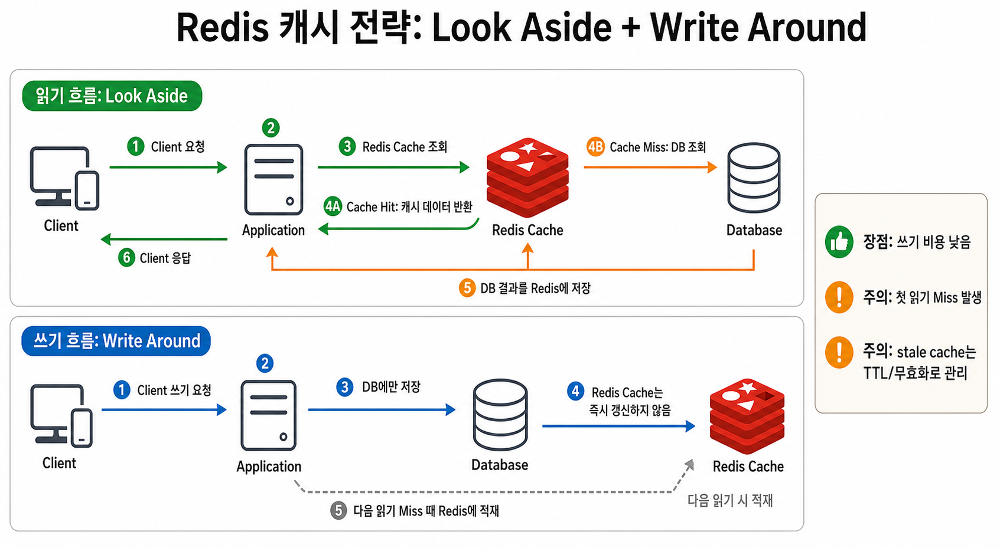

# Redis Cache Aside and TTL Strategy

## 시나리오

사용자의 프로필이 자주 조회되지만 자주 바뀌지 않는 기능(R8~9:W1~2) 으로 동작한다면,
아래와 같은 기준으로 적합한 방향은 어떤게 있을지 생각해보자

0. 들어가기전 체크
    - 현재 시나리오의 캐시의 이용은 영속성을 다루는 저장소로 이용이 아닌, 메모리를 이용한 빠른 응답 제공으로 성능 향상 초점을 두자
1. 캐시 전략
    1. 읽기(Look-Aside 패턴 사용)
        - 데이터의 조회를 캐시를 우선적으로 조회, 만일 없으면 DB에서 조회
            - 장점
                - 캐시레이어와 DB레이어를 분리해서 가용
                    - 캐시가 다운되어도 DB에서 가져올 수 있음
                - 모든 데이터를 캐시에 저장하는게 아닌 원하는 데이터만 별도로 캐시에 저장
                - 반복적인 읽기 호출에 적합
            - 단점
                - 정합성 유지 문제
                    - 캐시에 있는 데이터와 DB의 데이터간의 정합성 문제가 있음
                - 초기 조회시 문제 (Thundering Herd)
                    - 단건 호출 빈도가 높은(메인 페이지 조회) 곳에 초기 캐시에 데이터가 없어(Cache miss) 모든 호출이 DB로 가 부하가 생길 수 있음
    2. 쓰기(Write-Around 패턴 사용)
        - 모든 데이터 저장은 DB에만 이후 Cache miss시 캐시에 저장
            - 장점
                - Write Through 패턴보다 상대적 빠름
                    - Write Through 패턴 => 캐시와 DB에 동시에 데이터를 저장함
            - 단점
                - 속도는 빠르지만 Cache miss가 발생하기전에 DB의 데이터는 수정되었을때, 캐시와 DB와의 정합성 문제가 생김
    3. 결론

         <details>
         <summary>Look-Aside & Write-Around 조합으로 사용</summary>
         <div markdown="1">

         

         </div>
         </details>

2. 캐시 무효화 전략
    - 영구 저장소에 저장된 데이터의 복사본으로 동작하기에 캐시 <> DB와의 데이터 동기화 작업 필요
    - 적절한 TTL 설정으로 DB의 부하를 줄여주고, 캐시 데이터의 노후화되는 것도 방지 고려
    - 고려할 점
        - 캐시 스탬피드 대응
            - 키 만료시 수 많은 동시 요청이 DB로 가게되는 duplicated read 발생
            - 반대로, 동시에 DB에 읽어와 레디스에 duplicated write 도 발생
            - 불필요한 작업과 DB 과부하로 인한 장애 가능성

---

3. 캐시 공유 전략 (Race Condition)
    - 레디스는 공유 메모리처럼 동작
    - 만약 여러 인스턴스가 동시 공유 데이터의 업데이트를 한다면 의도와 다르게 문제가 발생 (overwrite)
    - 레디스는 싱글 스레드라고 하는데 '왜 atomic하게 동작하지 않지?'라고 생각할 수 있음
        - 레디스는 명령(command) 실행 단위의 싱글 스레드임 => 중요!
            - 동작 흐름을 보자면, 아래 3번의 동작을 하게됨 즉, 하나의 동작으로 보지 않음
                - (1) 읽기 -> (2) 어플리케이션 계산 -> (3) 다시 쓰기
    - 해결책
        - 락을 잘 거는 것이 중요한게 아닌, 락이 필요없는 구조를 만드는 게 중요하다. 항상 트레이드 오프를 생각하자

        1. Atomic Operation 사용
        2. Optimistic Lock
        3. Pessimistic Lock
        4. Distributed Lock
        5. lua script

----

## 이번 단계의 범위

Issue #28에서는 cache-aside 읽기 흐름만 구현한다.
TTL jitter, cache stampede 방지, negative caching, 캐시 무효화 전략은 후속
이슈에서 다룬다.

----

## 저장소 선택

SQLite는 source of truth 역할만 담당한다. 이 프로젝트의 학습 대상은
RDBMS가 아니라 Redis 캐시 전략이므로, DB 운영과 ORM 복잡도를 줄이기 위해
SQLite를 선택했다.

이번 단계에서는 별도 내부 모델을 만들지 않고 기존 `UserProfileResponse`를
SQLite 조회 결과, Redis 캐시 값, API 응답에 함께 사용한다. 캐시 전략 학습이
우선이므로 모델 분리는 후속 리팩터링 후보로 남긴다.

----

## 구조

```text
route
  -> service
      -> cache
      -> repository
```

- `UserProfileService`: cache-aside 읽기 흐름을 담당한다.
- `UserProfileCache`: Redis key, JSON 직렬화, TTL 저장을 담당한다.
- `UserProfileRepository`: SQLite 원본 저장소 조회를 담당한다.
- `user_route.py`: HTTP 응답과 예외 변환만 담당한다.

----

## 현재 한계

- TTL은 고정값을 사용한다.
- TTL jitter는 아직 적용하지 않았다.
- cache stampede 방지 lock은 아직 적용하지 않았다.
- negative caching은 아직 적용하지 않았다.
- cache invalidation 전략은 아직 다루지 않았다.
